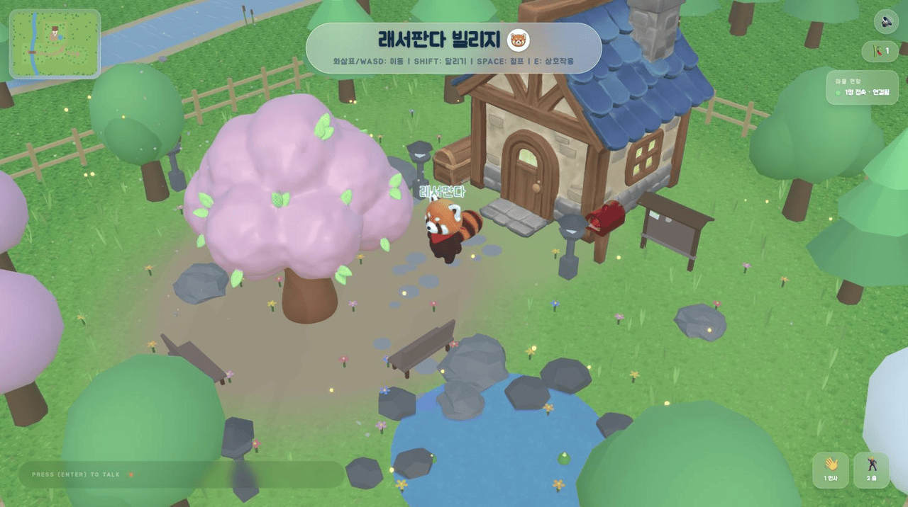
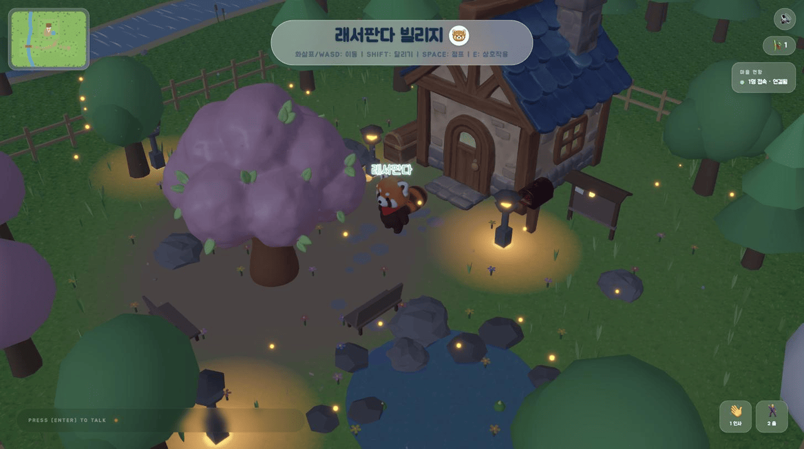
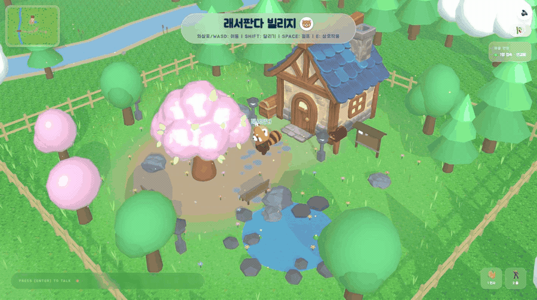

# 래서판다 빌리지

여러 명이 같은 레서판다 마을에 접속해서 돌아다니고 채팅하고, 남이 놓고 간 흔적을 보는 웹 게임입니다.

**[▶ 지금 플레이하기](https://lessor-panda-village.vercel.app)** · 설치 없이 브라우저에서 바로 됩니다.

  
  

낮과 밤은 2분마다 바뀝니다. 언제 접속하든 모두 같은 시간대를 봅니다.

---

## 할 수 있는 것

- 걷기, 달리기, 점프, 클릭 이동, 인사/춤 이모트, 벤치 앉기
- 대나무 숲에서 죽순 수확 (30초 뒤 다시 자람)
- 죽순으로 마을 게시판에 방명록 걸기. 나중에 다시 와서 볼 수 있습니다
- 다른 접속자와 위치, 상태, 채팅을 실시간으로 공유
- 2분 주기 낮/밤 전환

가입은 없습니다. Supabase 익명 로그인으로 계정을 만들고, 닉네임과 남긴 흔적은 서버에 그대로 남습니다.

## 기술 스택

| 영역 | 사용 기술 |
|---|---|
| 렌더링 | React Three Fiber, drei, Three.js, postprocessing |
| 프레임워크 | Next.js 16 (App Router), React 19, TypeScript strict |
| 상태 | Zustand |
| 백엔드 | Supabase (Auth · Postgres · Realtime) |
| 스타일 | Tailwind CSS 4 |
| 에셋 파이프라인 | glTF-Transform (meshopt · webp · simplify) |

## 만들면서 푼 문제

### 60fps 맞추기

브라우저에서 도는 3D라 프레임이 밀리면 바로 티가 납니다. 프로파일러로 잡히는 것부터 걷어냈습니다.

| 항목 | 개선 전 | 개선 후 |
|---|---|---|
| 집 / 고목 삼각형 | 885,380 / 349,791 | 46,067 / 22,127 |
| `public/models` 용량 | 9.1MB | 3.2MB |
| 정적 인스턴스 행렬 갱신 | 매 프레임 약 2,700개 | 리렌더 직후 1프레임 |
| 그림자맵 | 매 프레임 재생성 | 캐스터가 움직인 프레임만 |
| 후처리 MSAA | 8× (약 300MB 렌더 타깃) | 4× |

압축은 용량보다 렌더 비용 때문에 했습니다. 다운로드 크기를 85% 줄여도 GPU가 그리는 삼각형 수는 그대로였거든요. 원본이 AI로 뽑은 메시라 정점이 1,100개 넘는 조각으로 쪼개져 있어서 단순화가 아예 안 걸렸습니다. `weld`를 먼저 돌리고 나서야 실루엣을 유지한 채(오차는 메시 반경의 0.1%) 94%를 줄일 수 있었습니다. 제대로 줄었는지는 월드 bbox를 비교해서 확인합니다. 충돌 박스가 이 크기를 기준으로 잡혀 있어서 여기가 틀어지면 안 됩니다.

drei `<Instances>`의 `frames` 기본값이 `Infinity`인 것도 뒤늦게 봤습니다. 배치가 전혀 안 바뀌는 정적 경관인데 매 프레임 인스턴스 전체의 행렬을 다시 만들고 버퍼를 통째로 올리고 있었습니다.

그림자는 캐스터가 움직인 프레임에만 다시 그립니다. 이 월드에서 움직이는 건 플레이어랑 태양뿐입니다. 제자리 이모트처럼 위치는 그대로인데 포즈만 바뀌는 경우가 있어서 그건 따로 신호를 줍니다.

### 클라이언트가 보낸 값 안 믿기

Realtime broadcast는 결국 클라이언트가 보내는 값이라 위조할 수 있습니다.

- 방명록은 broadcast를 "새 글 생겼다"는 신호로만 쓰고, 내용은 매번 RLS 걸린 DB에서 다시 읽습니다.
- 받은 위치, 닉네임, 애니메이션 이름은 길이와 숫자 범위, 허용된 값 목록으로 걸러서 씁니다.
- 익명 사용자는 자기 프로필이랑 자기가 남긴 것만 건드릴 수 있고, 삭제는 소프트 삭제만 됩니다. 지형을 마음대로 고치는 권한은 안 열었습니다.
- 타입 검사랑 빌드로는 RLS나 grant 문제가 안 잡힙니다. `pnpm world:verify`가 앱이랑 같은 요청 경로로 권한 경계를 직접 찔러봅니다.

### 리렌더 없이 동기화하기

접속자가 늘어도 React 트리가 다시 그려지지 않게, 위치는 state 대신 `ref`에 넣고 `useFrame`에서 직접 보간합니다. 위치 전송은 10fps로 스로틀하고 일정 이상 움직였을 때만 보냅니다.

### 월드 배치를 한 곳에서만

월드 배치는 `src/constants/world`에만 적고, 충돌이랑 미니맵, 경계는 전부 거기서 계산해서 씁니다. JSX에 좌표를 또 적지 않습니다.

충돌 판정은 공간 해시 그리드로 합니다. A\* 길찾기가 클릭 한 번에 수만 번 도는데 도형을 전부 훑으면 프레임이 튑니다.

월드 크기도 콘텐츠에 맞춰 줄였습니다. 걷기 한계가 정사각형이라 아무것도 없는 북쪽에 57유닛짜리 빈 잔디가 남아 있었습니다. 경계를 배치 데이터에서 계산하게 바꿔서 걷는 면적을 48% 줄였고, 네 존이랑 상호작용 오브젝트에 여전히 다 갈 수 있는지는 스크립트로 확인했습니다.

경계 숲은 난수로 안 뿌리고 정해진 규칙으로 만듭니다. 랜덤으로 두면 벽에 10~14유닛짜리 구멍이 나서 월드 바깥이 그대로 보입니다. 둘레를 균등하게 나눈 다음 한 칸 폭만큼만 흐트러뜨리면 줄 서 보이지도 않고 빈틈이 최대 4.2유닛까지만 벌어집니다. 수관 반경이 2.0~3.7이라 이 정도면 막힙니다.
