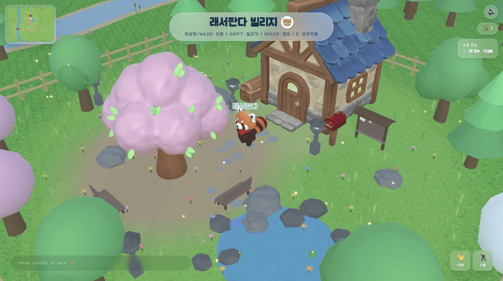
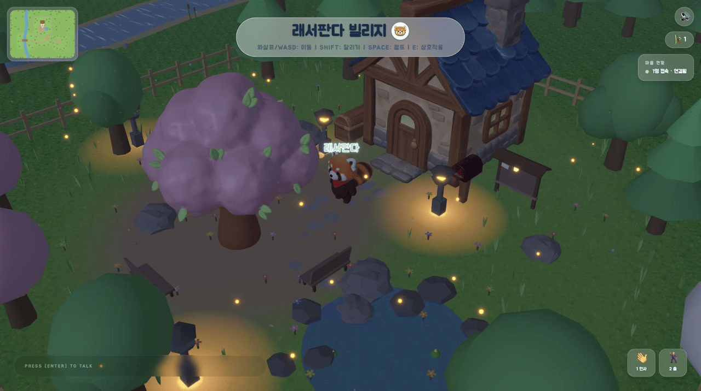
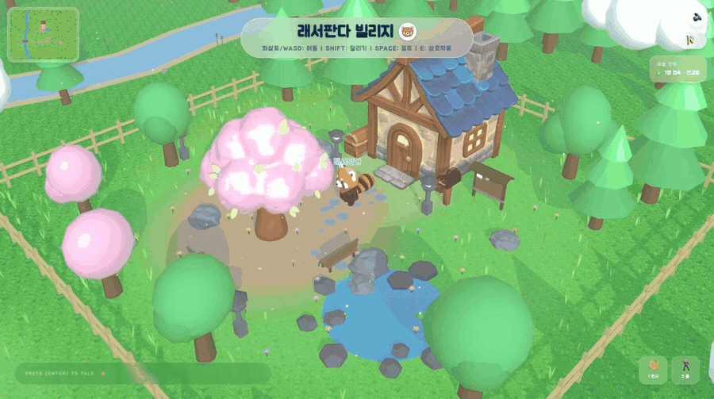

# 래서판다 빌리지

닉네임만 정하고 산책하며 다른 방문자가 남긴 쪽지를 읽는 3D 웹 프로젝트.

[마을 둘러보기](https://lessor-panda-village.vercel.app)

  
  

걷기·달리기·점프, 벤치 앉기, 인사·춤, 죽순 수확, 방명록과 실시간 채팅을 체험할 수 있다. 서버 연결이 어려워도 불러온 마을을 산책할 수 있고, 그래픽 품질은 자동 또는 수동으로 조절한다.

## 제작

체험과 화면을 기획하고 AI 코딩 도구로 구현·수정했다. 생성형 3D 에셋을 사용했으며, 프런트엔드 구성과 인터랙션을 다듬는 데 집중했다.

Next.js · React · TypeScript · React Three Fiber · Three.js · Zustand · Supabase · Tailwind CSS

월드 배치는 렌더링·충돌·미니맵이 공유한다. 쪽지는 DB에 보존하고 움직임은 실시간으로 전달한다. 모델은 스크립트로 변환하며, 원격 캐릭터에는 거리별 LOD를 적용한다.

P400의 1080p·30fps 목표와 실서버 3~4인 접속은 아직 실측·검증이 필요하다. [유지할 결정과 남은 확인](docs/architecture.md)
